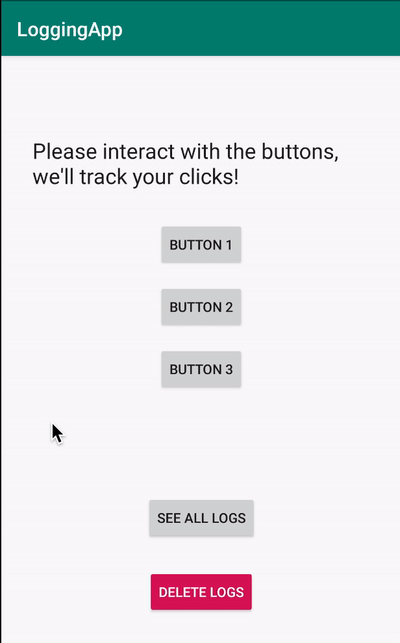

# Using Hilt in your Android app

[Google Codelab: Using Hilt in your Android app](https://codelabs.developers.google.com/codelabs/android-hilt/index.html)

## Introduction

Hilt is an opinionated Dependency Injection library for Android that reduces the boilerplate of using manual DI in your project. Doing [manual dependency injection](https://developer.android.com/training/dependency-injection/manual) requires constructing every class and its dependencies by hand and using containers to reuse and manage dependencies.

Hilt provides a standard way to do DI injection in your application by providing containers to every Android component in your project and managing the container's lifecycle automatically for you. This is done by leveraging the popular DI library: [Dagger](https://developer.android.com/training/dependency-injection/dagger-basics).

## Topics

* How to use Hilt in your Android app.
* Relevant Hilt concepts to create a more solid and sustainable app.
* How to add multiple bindings to the same type with qualifiers.
* How to access elements in containers in classes that Hilt doesn't support with @EntryPoint.
* How to test your application that uses Hilt with unit and instrumentation tests.

## App Demo

